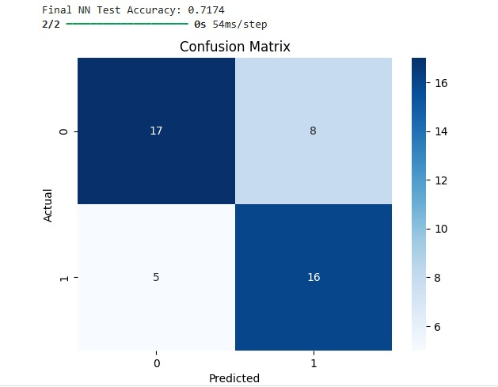
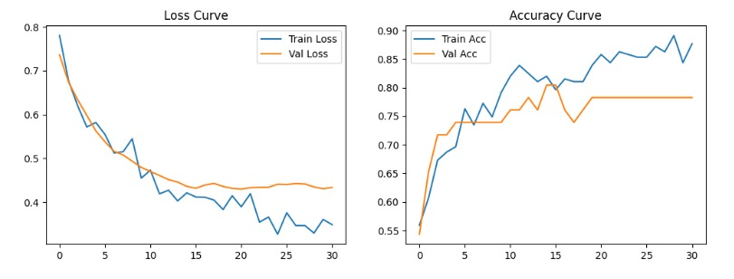
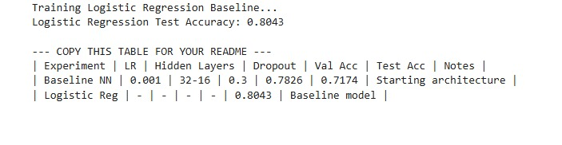

# Heart Disease Prediction using Neural Network

A deep learning project to predict heart disease using the UCI Heart Disease dataset. Built with TensorFlow/Keras.

## 📊 Results
- **Test Accuracy**: 71.74%
- **Training Accuracy**: 72.22%
- **Loss**: 0.56

## 📸 Screenshots

## 🛠️ Tech Stack
`Python` `TensorFlow` `Keras` `Pandas` `Scikit-learn` `Matplotlib`

## 🚀 How to Run
1. Clone the repo: `git clone https://github.com/hamailf-dev/heart-disease-nn.git`
2. Open `heart_disease_nn.ipynb` in Jupyter Notebook / Google Colab
3. Run all cells

## 📁 Dataset
UCI Heart Disease Dataset
